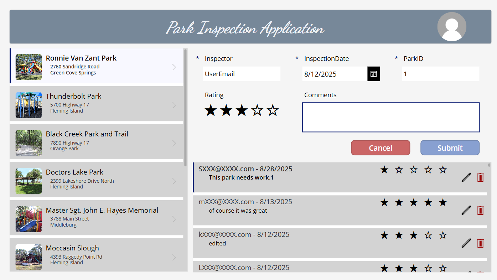

# park-inspection-app

A responsive canvas app built in one day during the "App in a Day" program with Pragmatic Works.  
The app allows park inspectors to record inspections, ratings, and comments, and review past inspection history.

---

## Features
- Park selection from a gallery with images
- Form to capture inspector name, inspection date, rating, and comments
- Review of recent inspection history
- Submit and cancel buttons for form control
- Responsive design for tablet use
- Connects to SQL Server for secure data storage

---

## Tech Stack
- Microsoft Power Apps (Canvas App)
- SQL Server (Azure SQL or On-premises via Gateway)

---

## How to Use
1. Download the `.msapp` file from the [`dist`](dist) folder.
2. In Power Apps, go to **Apps → Import canvas app** and upload the file.
3. Reconnect the SQL Server data source to your own database with a compatible schema.
4. Publish and run the app in your environment.

---

## Screenshot

---

## Notes
- This repo includes only the app definition; no data is included.
- Connection references and environment variables will need to be configured on import.
